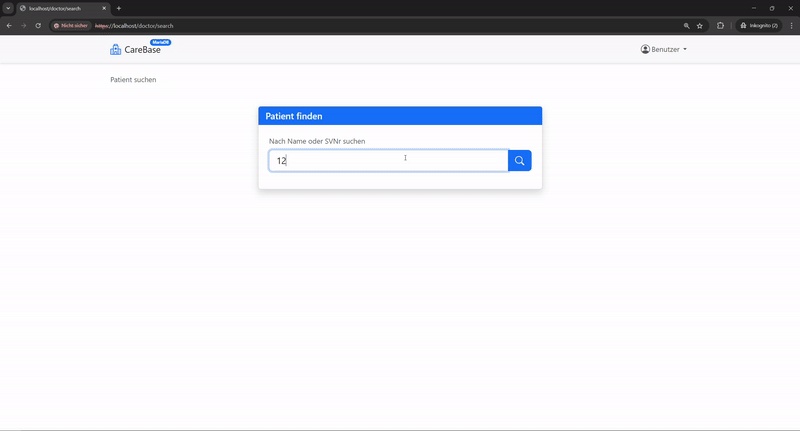
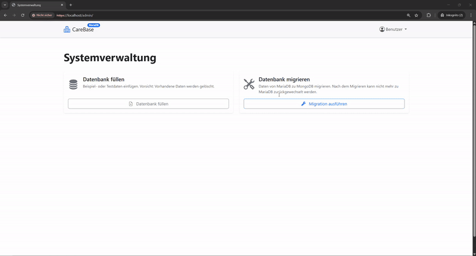
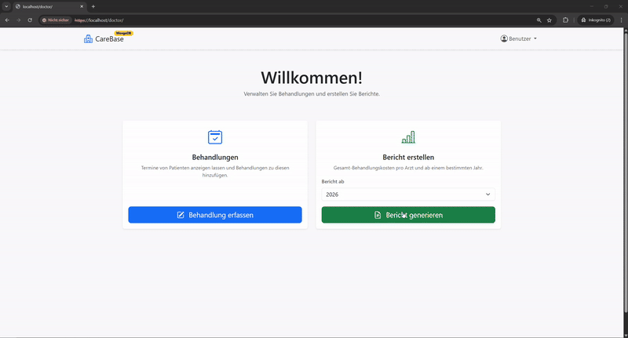

# CareBase ‒ Hospital Information System (SQL & NoSQL)


CareBase is a web-based hospital information system developed as part of a university course.

The core objective of this project was to implement a flexible application capable of operating on both a Relational Database Management System (RDBMS) and a NoSQL database, including a feature for live data migration and seamless runtime switching between technologies using the Strategy Pattern.





## Features

- **Dual-Database Support**: The system runs fully functional on either MariaDB (SQL) or MongoDB (NoSQL).
- **Live Data Migration**: An integrated migration engine transforms relational SQL data into document-oriented JSON structures, automatically handling embedding and denormalization.
- **Role-Based Access Control**:
  - Doctor ("Arzt"): Manage patient treatments and view medical history.
  - Clerk ("Sachbearbeiter"): Schedule and manage appointments with collision detection.
  - Admin: Generate synthetic test data (utilizing the `faker` library and optimized bulk inserts via `executemany`).
- **Analytics Dashboard**
  - **Report 1**: Total treatment costs per doctor (aggregated by year).
  - **Report 2**: Patient visit frequency analysis per doctor

## Tech Stack & Architecture

The entire infrastructure is containerized and orchestrated via Docker Compose:

- **Application**: Python Flask (Backend) with Jinja2 Templates, styled with Bootstrap CSS (Frontend).
- **Databases**:
  - **MariaDB**: For the relational implementation.
  - **MongoDB**: For the document-oriented implementation.
- **Web Server**: Nginx (Reverse Proxy for HTTPS with self-signed certificates).

### Software Design Patterns

We implemented a robust architecture to decouple the application logic from the database layer:

- **Repository Pattern**: The application interacts with the database solely through an abstract interface (`DBStrategy`). This abstracts the complex data access logic (SQL queries vs. MongoDB aggregations) into clean methods like `get_patient_details` or `add_treatment`, keeping the frontend code clean and storage-agnostic.
- **Strategy Pattern**: To enable the live switching requirement, the Repository is implemented as a Strategy. The application holds a reference to the abstract strategy, while the concrete implementation (`MariaDBStrategy` or `MongoDBStrategy`) can be swapped at runtime via the migration interface.

## Database Design Decisions

### SQL Implementation (MariaDB)

The relational model follows a strictly normalized schema ensuring data consistency, involving entities such as Person, Patient, Doctor, Appointment, and Treatment.

### NoSQL Implementation (MongoDB)

For the migration to MongoDB, we optimized the schema for read performance by leveraging denormalization and specific NoSQL patterns:

- **Embedding over Referencing**:
  - Treatments and Appointments were embedded directly into the Patient document to reduce the need for expensive $lookup (Join) operations.
  - Department details are embedded within the Doctor document as they rarely change.
- **Computed Pattern**:
  - For the cost analytics report, aggregated sums (e.g., costs_2025) are stored directly in the Doctor document and incremented on every write. This avoids computationally expensive aggregation pipelines during read time.
- **Hybrid Approach for Appointments**:
  - Although appointments are embedded in patients, a separate Appointment collection was maintained. This allows the system to efficiently query for free time slots (Clerk Use Case) without needing to `$unwind` thousands of patient documents, balancing storage redundancy against query performance .

## Setup & Usage

Prerequisites: Docker and Docker Compose must be installed.

1. **Clone the repository**

    ```bash
    git clone https://github.com/jakspt/carebase.git
    cd carebase
    ```

2. **Start the system**

    ```bash
    docker compose up
    ```

    The application will be accessible at <https://localhost>.

3. **Generate Data**

    Navigate to the Admin panel in the browser and click "Fill Database" ("Datenbank füllen") to generate synthetic test data.

4. **Execute Migration**

    After testing the SQL functionality, click "Execute Migration" ("Migration ausführen") to transform the data and switch the active backend strategy to MongoDB. Note: This is a one-way process for this demonstration.
